# Consolidate Pipeline into Unified Workflow with Mode-Based Entry Points

## 🎯 Overview

This PR consolidates the pipeline architecture from separate workflow files into a **single unified workflow** (`PROTEIN_DESIGN`) with three distinct entry points based on operational mode. This simplifies maintenance, ensures consistency, and provides clearer user control through explicit mode selection.

## 🔄 Architecture Changes

### Before
```
main.nf
├── Auto-detect mode from samplesheet
├── TARGET_TO_DESIGNS workflow (separate file)
├── P2RANK_TO_DESIGNS workflow (separate file)
└── Design mode (inline in main.nf)
```

### After
```
main.nf
├── Explicit --mode parameter (with auto-detection fallback)
└── PROTEIN_DESIGN unified workflow
    ├── Design mode entry
    ├── Target mode entry
    └── P2Rank mode entry
    └── → All converge to same Boltzgen + IPSAE execution
```

## 🚀 Key Features

### 1. Unified Workflow Architecture
- **New file**: `workflows/protein_design.nf` - Single workflow for all modes
- **Consolidated execution**: All modes share the same core workflow after preprocessing
- **Simplified maintenance**: Updates benefit all modes simultaneously
- **Consistent outputs**: Standardized result structure across modes

### 2. Explicit Mode Selection
Users can now specify mode explicitly:
```bash
--mode design   # Use pre-made design YAMLs
--mode target   # Generate design variants from targets
--mode p2rank   # Auto-identify binding sites with ML
```

### 3. Backward Compatibility
- Auto-detection still works from samplesheet headers
- Existing samplesheets continue to work without changes
- All existing parameters remain functional

## 📝 Changes by Component

### Core Pipeline Files
- ✅ **`main.nf`**: Refactored to use mode parameter and route to unified workflow
- ✅ **`nextflow.config`**: Added `mode` parameter with validation
- ✅ **`workflows/protein_design.nf`**: New unified workflow consolidating all modes

### Documentation Updates
- ✅ **`README.md`**: Updated with unified architecture description and new mermaid diagram
- ✅ **`docs/WORKFLOW_MODES.md`**: Complete rewrite explaining unified approach, added P2Rank mode section
- ✅ **`docs/P2RANK_MODE.md`**: Updated with explicit mode examples and workflow diagram
- ✅ **`docs/TARGET_BASED_MODE.md`**: Updated with unified workflow context and mode options

### Workflow Changes
- 🔄 **`workflows/target_to_designs.nf`**: Still present but no longer used (can be removed in future)
- 🔄 **`workflows/p2rank_to_designs.nf`**: Still present but no longer used (can be removed in future)

## 🎨 Updated Pipeline Flow Diagram

New mermaid diagram showing mode-based entry and convergence:

```mermaid
flowchart TD
    A[📋 Input Samplesheet CSV] --> B{Mode Selection}
    B -->|--mode design| C1[📄 Design Mode]
    B -->|--mode target| C2[🎯 Target Mode]
    B -->|--mode p2rank| C3[🔬 P2Rank Mode]
    B -->|auto-detect| C4{Detect from Headers}
    
    C4 -->|design_yaml column| C1
    C4 -->|target_structure column| C2
    
    C1 --> D1[Use Pre-made<br/>Design YAMLs]
    C2 --> D2[Generate Design<br/>Variants from Target]
    C3 --> D3[P2Rank Predict<br/>Binding Sites]
    
    D2 --> D2a[Create Multiple<br/>Length/Type Variants]
    D3 --> D3a[Format Binding Sites<br/>into Design YAMLs]
    
    D1 --> E[🔀 Unified Workflow Entry]
    D2a --> E
    D3a --> E
    
    E --> F[📦 Parallel Design Processing]
    F --> G[⚡ BOLTZGEN_RUN]
    G --> H[IPSAE Optional]
    H --> I[✅ Results]
```



## 📊 Mode Comparison

| Aspect | Design | Target | P2Rank |
|--------|--------|--------|--------|
| **Input** | YAML files | Target structure | Target structure |
| **Setup** | Manual YAMLs | 1 CSV line | 1 CSV line |
| **Binding sites** | Manual | Manual | Auto-predicted (ML) |
| **Best for** | Specific goals | Exploration | Drug discovery |
| **Control** | Full | Automated | ML-automated |

## 🔧 Usage Examples

### Design Mode
```bash
nextflow run FloWuenne/nf-proteindesign-2025 \
    -profile docker \
    --mode design \
    --input samplesheet_designs.csv \
    --outdir results
```

### Target Mode
```bash
nextflow run FloWuenne/nf-proteindesign-2025 \
    -profile docker \
    --mode target \
    --input samplesheet_targets.csv \
    --outdir results
```

### P2Rank Mode
```bash
nextflow run FloWuenne/nf-proteindesign-2025 \
    -profile docker \
    --mode p2rank \
    --input samplesheet_targets.csv \
    --top_n_pockets 3 \
    --outdir results
```

## ✅ Benefits

1. **Easier Maintenance**: Single workflow file to update instead of three
2. **Consistency**: All modes use identical execution logic after preprocessing
3. **Clearer User Intent**: Explicit `--mode` parameter removes ambiguity
4. **Better Testing**: One workflow to test thoroughly
5. **Future-Proof**: Easy to add new modes or modify existing ones
6. **Documentation**: Clearer explanation of how modes relate to each other

## 🧪 Testing Recommendations

Before merging, please test:
- [ ] Design mode with existing samplesheets
- [ ] Target mode with auto-detection
- [ ] P2Rank mode with explicit `--mode p2rank`
- [ ] Auto-detection from samplesheet headers
- [ ] IPSAE optional scoring in all modes

## 📚 Related Documentation

- Mode selection guide: `docs/WORKFLOW_MODES.md`
- P2Rank mode details: `docs/P2RANK_MODE.md`
- Target mode details: `docs/TARGET_BASED_MODE.md`
- Main README with updated diagram: `README.md`

## 🔮 Future Improvements

After this PR, we could:
1. Remove old workflow files (`target_to_designs.nf`, `p2rank_to_designs.nf`)
2. Add more mode-specific validations
3. Create mode-specific config profiles
4. Add integration tests for mode switching

---

## 📦 Summary

This PR implements a cleaner, more maintainable architecture while preserving all existing functionality. Users gain explicit control over mode selection while maintaining backward compatibility through auto-detection.
