# nf-proteindesign

[](https://www.nextflow.io/)
[](https://www.docker.com/)
[](https://sylabs.io/docs/)
[](https://flouwuenne.github.io/nf-proteindesign-2025/)

> **📚 Full documentation is now available at:** [https://flouwuenne.github.io/nf-proteindesign-2025/](https://flouwuenne.github.io/nf-proteindesign-2025/)

## Introduction

**nf-proteindesign** is a Nextflow pipeline for running [Boltzgen](https://github.com/HannesStark/boltzgen) protein design workflows in parallel across multiple design specifications. Boltzgen is an all-atom generative diffusion model that can design proteins, peptides, and nanobodies to bind various biomolecular targets (proteins, nucleic acids, small molecules).

The pipeline features a **unified workflow architecture** with three operational modes accessible through a single entry point:
1. **Design mode** (`--mode design`): Use pre-made design YAML files
2. **Target mode** (`--mode target`): Automatically generate design variants from target structures
3. **P2Rank mode** (`--mode p2rank`): Use ML to identify binding sites and design binders

All modes utilize the same core workflow with mode-specific entry points, enabling high-throughput parallel protein design campaigns with automatic binding site prediction using [P2Rank](https://github.com/rdk/p2rank), a state-of-the-art machine learning tool.

## Pipeline summary

1. **Validate Samplesheet**: Checks samplesheet format and validates design YAML files exist
2. **Run Boltzgen**: Executes Boltzgen for each sample in parallel with specified parameters
3. **ProteinMPNN Optimization** (optional): Optimizes sequences for designed structures using ProteinMPNN
4. **IPSAE Scoring** (optional): Evaluates protein-protein interactions using ipSAE metrics
5. **PRODIGY Prediction** (optional): Predicts binding affinity (ΔG and Kd) for designed complexes
6. **Collect Results**: Organizes outputs including final ranked designs, intermediate designs, and metrics

## Pipeline Flow

```mermaid
flowchart TD
    A[📋 Input Samplesheet CSV] --> B{Mode Selection}
    B -->|--mode design| C1[📄 Design Mode]
    B -->|--mode target| C2[🎯 Target Mode]
    B -->|--mode p2rank| C3[🔬 P2Rank Mode]
    B -->|auto-detect| C4{Detect from Headers}
    
    C4 -->|design_yaml column| C1
    C4 -->|target_structure column| C2
    
    C1 --> D1[Use Pre-made<br/>Design YAMLs]
    C2 --> D2[Generate Design<br/>Variants from Target]
    C3 --> D3[P2Rank Predict<br/>Binding Sites]
    
    D2 --> D2a[Create Multiple<br/>Length/Type Variants]
    D3 --> D3a[Format Binding Sites<br/>into Design YAMLs]
    
    D1 --> E[🔀 Unified Workflow Entry]
    D2a --> E
    D3a --> E
    
    E --> F[📦 Parallel Design Processing]
    
    F --> G1[⚡ Design 1<br/>BOLTZGEN_RUN]
    F --> G2[⚡ Design 2<br/>BOLTZGEN_RUN]
    F --> G3[⚡ Design N<br/>BOLTZGEN_RUN]
    
    G1 --> H1[🔄 Generation Pipeline<br/>Design → Inverse Fold<br/>Refold → Filter]
    G2 --> H2[🔄 Generation Pipeline<br/>Design → Inverse Fold<br/>Refold → Filter]
    G3 --> H3[🔄 Generation Pipeline<br/>Design → Inverse Fold<br/>Refold → Filter]
    
    H1 --> I1[📁 Results 1]
    H2 --> I2[📁 Results 2]
    H3 --> I3[📁 Results N]
    
    I1 --> I{ProteinMPNN Enabled?}
    I2 --> I
    I3 --> I
    
    I -->|Yes| I4[🧬 ProteinMPNN<br/>Sequence Optimization]
    I -->|No| J{IPSAE Enabled?}
    I4 --> J
    
    J -->|Yes| K[📊 IPSAE Scoring]
    J -->|No| M{PRODIGY Enabled?}
    K --> M
    
    M -->|Yes| N[⚡ PRODIGY Affinity<br/>Prediction]
    M -->|No| L[✅ Final Output]
    N --> L
    
    style B fill:#fff4e1
    style C1 fill:#e1f5ff
    style C2 fill:#ffe1e1
    style C3 fill:#e1ffe1
    style E fill:#ffe1f5
    style F fill:#ffe1f5
    style L fill:#e1ffe1
```



### Unified Workflow Architecture

All three modes converge into a **single unified workflow** (`PROTEIN_DESIGN`) after their respective preprocessing steps:

- **Design mode**: Direct entry with pre-made YAMLs
- **Target mode**: Generates design variants, then enters unified workflow
- **P2Rank mode**: Predicts binding sites, formats as designs, then enters unified workflow

This architecture ensures consistent execution and simplifies maintenance while providing flexible entry points for different use cases.

## Quick Start

1. Install [`Nextflow`](https://www.nextflow.io/docs/latest/getstarted.html#installation) (`>=23.04.0`)

2. Install [`Docker`](https://docs.docker.com/engine/installation/) or [`Singularity`](https://www.sylabs.io/guides/3.0/user-guide/) (required for GPU access)

3. Prepare your design YAML files following [Boltzgen design specification format](#design-specification-format)

4. Create a samplesheet (see [example](#samplesheet-format))

5. Run the pipeline:

   ```bash
   nextflow run FloWuenne/nf-proteindesign-2025 \
       -profile docker \
       --input samplesheet.csv \
       --outdir results
   ```

## Testing the Pipeline

The pipeline includes comprehensive test profiles for all three operational modes using EGFR (PDB: 1IVO) as a real example:

### Quick Test Commands

```bash
# Test Design Mode (pre-made YAML configs)
nextflow run FloWuenne/nf-proteindesign-2025 -profile test_design,docker

# Test Target Mode (auto-generate designs from structure)
nextflow run FloWuenne/nf-proteindesign-2025 -profile test_target,docker

# Test P2Rank Mode (binding site prediction + auto-design)
nextflow run FloWuenne/nf-proteindesign-2025 -profile test_p2rank,docker
```

### Test Data

Each test profile includes:
- ✅ Real EGFR structure (1IVO) from PDB
- ✅ Three design types: protein, peptide, and nanobody binders
- ✅ Minimal resource settings for fast execution (~15-45 minutes)
- ✅ Reduced num_designs (10) and budget (2) for quick testing

**Test outputs**: `./results_test_design`, `./results_test_target`, `./results_test_p2rank`

See [`assets/test_data/TEST_PROFILES.md`](assets/test_data/TEST_PROFILES.md) for detailed documentation and [`assets/test_data/QUICK_TEST_REFERENCE.md`](assets/test_data/QUICK_TEST_REFERENCE.md) for quick reference.

## Operational Modes

The pipeline automatically detects the mode from your samplesheet, or you can specify it explicitly with `--mode`.

### 1. Design Mode

Provide pre-made design YAML files in your samplesheet:

```bash
nextflow run FloWuenne/nf-proteindesign-2025 \
    -profile docker \
    --mode design \
    --input samplesheet_designs.csv \
    --outdir results
```

Or let the pipeline auto-detect (if samplesheet has `design_yaml` column):
```bash
nextflow run FloWuenne/nf-proteindesign-2025 \
    -profile docker \
    --input samplesheet_designs.csv \
    --outdir results
```

### 2. Target Mode

Automatically generate design variants from target structures:

```bash
nextflow run FloWuenne/nf-proteindesign-2025 \
    -profile docker \
    --mode target \
    --input samplesheet_targets.csv \
    --outdir results
```

Or with auto-detection (samplesheet has `target_structure` column):
```bash
nextflow run FloWuenne/nf-proteindesign-2025 \
    -profile docker \
    --input samplesheet_targets.csv \
    --outdir results
```

See [Target Mode Documentation](docs/TARGET_BASED_MODE.md) for details.

### 3. P2Rank Mode

Use machine learning to automatically identify binding sites and design binders:

```bash
nextflow run FloWuenne/nf-proteindesign-2025 \
    -profile docker \
    --mode p2rank \
    --input samplesheet_targets.csv \
    --top_n_pockets 3 \
    --outdir results
```

Or enable via parameter (auto-detects target mode + P2Rank):
```bash
nextflow run FloWuenne/nf-proteindesign-2025 \
    -profile docker \
    --input samplesheet_targets.csv \
    --use_p2rank \
    --top_n_pockets 3 \
    --outdir results
```

**Key Features:**
- ✅ Automatic binding site identification using P2Rank ML model
- ✅ Fast (<1s per protein) and accurate predictions
- ✅ No manual binding site specification required
- ✅ Targets multiple predicted pockets simultaneously
- ✅ State-of-the-art binding site prediction (600+ citations)

**Perfect for:**
- Drug discovery: identify druggable pockets
- Protein engineering: design binders without prior knowledge
- High-throughput screening: process many targets automatically

See [**P2Rank Mode Documentation**](docs/P2RANK_MODE.md) for complete usage guide.

## Optional Analysis Features

### IPSAE Scoring

Calculate interface Predicted Aligned Error (ipSAE) scores to evaluate protein-protein interaction confidence. Enable with `--run_ipsae`.

### PRODIGY Binding Affinity Prediction

Predict binding free energy (ΔG) and dissociation constants (Kd) for designed protein-protein complexes using the PRODIGY method. Enable with `--run_prodigy`.

**PRODIGY provides:**
- 🔬 Binding affinity prediction (ΔG in kcal/mol)
- 📊 Dissociation constant (Kd in Molar)
- 🧪 Buried surface area analysis
- ⚡ Interface composition analysis (charged, apolar residues)
- 🚀 Fast prediction (~1-5s per structure)

```bash
nextflow run FloWuenne/nf-proteindesign-2025 \
    -profile docker \
    --input samplesheet.csv \
    --run_prodigy \
    --run_ipsae \
    --outdir results
```

See [**PRODIGY Usage Documentation**](docs/PRODIGY_USAGE.md) for complete guide.

### Consolidated Metrics Report

Generate a comprehensive ranked report that aggregates all design metrics from Boltzgen, ProteinMPNN, IPSAE, and PRODIGY into a single summary. Enable with `--run_consolidation`.

**The consolidation report provides:**
- 📊 Ranked list of all designs by composite quality score
- 📈 Summary statistics across all metrics
- 📝 Detailed CSV file with all metrics for downstream analysis
- 📄 Human-readable Markdown report with interpretations
- 🎯 Top N designs highlighted with quality indicators
- 💡 Automated recommendations for best designs

```bash
nextflow run FloWuenne/nf-proteindesign-2025 \
    -profile docker \
    --input samplesheet.csv \
    --run_ipsae \
    --run_prodigy \
    --run_proteinmpnn \
    --run_consolidation \
    --report_top_n 15 \
    --outdir results
```

**Output files:**
- `design_metrics_summary.csv`: Complete metrics table (import to Excel/Python/R)
- `design_metrics_report.md`: Human-readable report with recommendations

See [**Consolidation Report Documentation**](docs/consolidation_report.md) for complete guide including interpretation of metrics and best practices.

## GPU Requirements

⚠️ **IMPORTANT: Boltzgen requires GPU (CUDA) to run.** The pipeline cannot run on CPU-only systems.

The pipeline is configured to work with:
- **Docker**: Uses `--gpus all` flag to enable GPU access
- **Singularity/Apptainer**: Uses `--nv` flag for NVIDIA GPU support

Ensure your compute environment has:
- NVIDIA GPU with CUDA support
- Appropriate GPU drivers installed
- Docker/Singularity configured for GPU access

Tested on NVIDIA A100 GPUs. See [Boltzgen documentation](https://github.com/HannesStark/boltzgen) for timing benchmarks.

## Samplesheet Format

The input samplesheet is a CSV file with the following columns:

| Column       | Required | Description |
|--------------|----------|-------------|
| sample_id    | Yes      | Unique identifier for the design run |
| design_yaml  | Yes      | Path to Boltzgen design specification YAML file |
| protocol     | No       | Boltzgen protocol (defaults to pipeline parameter) |
| num_designs  | No       | Number of intermediate designs (defaults to pipeline parameter) |
| budget       | No       | Final diversity-optimized design count (defaults to pipeline parameter) |
| reuse        | No       | Whether to reuse previous run results (true/false) |

### Example Samplesheet

```csv
sample_id,design_yaml,protocol,num_designs,budget
protein_binder_1,designs/protein_target1.yaml,protein-anything,10000,20
peptide_binder_1,designs/peptide_target1.yaml,peptide-anything,5000,10
nanobody_design,designs/nanobody_target.yaml,nanobody-anything,15000,30
small_mol_binder,designs/small_molecule.yaml,protein-small_molecule,8000,15
```

## Design Specification Format

Each design YAML file follows the Boltzgen design specification format. Here's a minimal example:

```yaml
entities:
  # Designed protein chain
  - protein: 
      id: C
      sequence: 80..140  # Random length between 80-140 residues
  
  # Target from PDB/CIF file
  - file:
      path: target.cif
      include: 
        - chain:
            id: A
```

### Example with binding site specification:

```yaml
entities:
  # Designed peptide
  - protein: 
      id: G
      sequence: 12..20
  
  # Target with specific binding site
  - file:
      path: target.cif
      include:
        - chain:
            id: A
      binding_types:
        - chain:
            id: A
            binding: 343,344,251  # Specific residues to bind
      structure_groups: "all"
```

See the [Boltzgen repository](https://github.com/HannesStark/boltzgen) for more complex examples including:
- Cyclic peptides
- Disulfide bonds
- Secondary structure constraints
- Nanobody scaffolds
- And more...

## Parameters

### Required Parameters

| Parameter | Description |
|-----------|-------------|
| `--input` | Path to samplesheet CSV file |

### Boltzgen Configuration

| Parameter | Default | Description |
|-----------|---------|-------------|
| `--protocol` | `protein-anything` | Default protocol for designs |
| `--num_designs` | `100` | Default number of intermediate designs (recommend 10,000-60,000 for production) |
| `--budget` | `10` | Default number of final diversity-optimized designs |
| `--cache_dir` | `null` | Directory for model weights (~6GB, defaults to ~/.cache) |
| `--boltzgen_config` | `null` | Path to custom Boltzgen config YAML |
| `--steps` | `null` | Comma-separated list of pipeline steps to run (e.g., 'filtering') |

### ProteinMPNN Sequence Optimization (Optional)

| Parameter | Default | Description |
|-----------|---------|-------------|
| `--run_proteinmpnn` | `false` | Enable ProteinMPNN sequence optimization of Boltzgen designs |
| `--mpnn_sampling_temp` | `0.1` | Sampling temperature (0.1-0.3 recommended, lower = more conservative) |
| `--mpnn_num_seq_per_target` | `8` | Number of sequence variants to generate per structure |
| `--mpnn_batch_size` | `1` | Batch size for ProteinMPNN inference |
| `--mpnn_seed` | `37` | Random seed for reproducibility |
| `--mpnn_backbone_noise` | `0.02` | Backbone noise level (0.02-0.20, lower = more faithful to input) |
| `--mpnn_save_score` | `true` | Save per-residue scores |
| `--mpnn_save_probs` | `false` | Save per-residue probabilities (large files) |
| `--mpnn_fixed_chains` | `null` | Chains to keep fixed (e.g., 'A,B' - typically target chains) |
| `--mpnn_designed_chains` | `null` | Chains to design (e.g., 'C' - typically binder chain) |

### Output Options

| Parameter | Default | Description |
|-----------|---------|-------------|
| `--outdir` | `./results` | Output directory for results |
| `--publish_dir_mode` | `copy` | Method for publishing output files (copy, symlink, etc.) |

### Resource Limits

| Parameter | Default | Description |
|-----------|---------|-------------|
| `--max_memory` | `128.GB` | Maximum memory per process |
| `--max_cpus` | `16` | Maximum CPUs per process |
| `--max_time` | `240.h` | Maximum time per process |
| `--max_gpus` | `1` | Maximum GPUs per process |

## IPSAE Scoring (Optional)

The pipeline includes optional **IPSAE (interprotein Structural Alignment Error)** scoring to evaluate the quality of protein-protein interactions in predicted structures. IPSAE is particularly useful for assessing the predicted binding interfaces between designed proteins/peptides and their targets.

### What is IPSAE?

IPSAE is a scoring function specifically developed for evaluating protein-protein interactions in AlphaFold2, AlphaFold3, and Boltz predictions. It provides:

- **ipSAE scores**: Quantitative assessment of predicted binding interfaces
- **Per-residue scores**: Identification of key interface residues
- **Multiple metrics**: Including pDockQ, pDockQ2, ipTM, and LIS scores
- **PyMOL visualization scripts**: For easy inspection of results

Reference: [Dunbrack Lab IPSAE](https://github.com/DunbrackLab/IPSAE)

### Enabling IPSAE Scoring

To enable IPSAE scoring, add the `--run_ipsae` flag:

```bash
nextflow run FloWuenne/nf-proteindesign-2025 \
    -profile docker \
    --input samplesheet.csv \
    --outdir results \
    --run_ipsae
```

### IPSAE Parameters

| Parameter | Default | Description |
|-----------|---------|-------------|
| `--run_ipsae` | false | Enable IPSAE scoring |
| `--ipsae_pae_cutoff` | 10 | PAE cutoff in Angstroms for interface residue identification |
| `--ipsae_dist_cutoff` | 10 | Distance cutoff in Angstroms for CA-CA contacts |

### Custom IPSAE Cutoffs

```bash
nextflow run FloWuenne/nf-proteindesign-2025 \
    -profile docker \
    --input samplesheet.csv \
    --run_ipsae \
    --ipsae_pae_cutoff 15 \
    --ipsae_dist_cutoff 15
```

### IPSAE Output Files

When IPSAE scoring is enabled, the following files are generated for each model:

```
results/
└── sample_id/
    ├── ipsae_scores/
    │   ├── *_model_0_10_10.txt                    # Chain-chain interaction scores
    │   ├── *_model_0_10_10_byres.txt              # Per-residue scores
    │   ├── *_model_0_10_10.pml                    # PyMOL visualization script
    │   ├── *_model_1_10_10.txt                    # Scores for additional models
    │   └── ...
```

#### Score File Format

The main score file (`*_10_10.txt`) contains:

- **Chain-pair metrics**: ipSAE, ipTM, pDockQ, pDockQ2, LIS
- **Residue counts**: Number of interface residues per chain
- **Distance metrics**: d0 values for different calculation methods

The per-residue file (`*_10_10_byres.txt`) provides:

- **Per-residue ipSAE scores**: Contribution of each residue to binding
- **pLDDT values**: Confidence scores per residue
- **Chain assignments**: Which residues interact with which chains

### Interpreting IPSAE Scores

- **ipSAE**: Higher values (0-1) indicate better predicted interfaces
  - > 0.6: High-confidence interaction
  - 0.4-0.6: Moderate confidence
  - < 0.4: Low confidence / likely non-specific

- **pDockQ**: Quality of protein-protein docking
  - > 0.23: Acceptable quality
  - > 0.49: Good quality

- **ipTM**: Interface predicted TM-score
  - > 0.5: Good interface alignment

## ProteinMPNN Sequence Optimization (Optional)

The pipeline includes optional **ProteinMPNN** sequence optimization to further refine the sequences of Boltzgen-designed structures. ProteinMPNN is a deep learning model trained to generate protein sequences that fold into desired backbone structures, and has been shown to increase design success rates by **~10-fold** compared to traditional methods.

### What is ProteinMPNN?

ProteinMPNN uses a graph neural network to predict amino acid sequences that will fold into a given protein backbone structure. Key features:

- **Fast**: Generates sequences in ~2 CPU-seconds per structure
- **Accurate**: Achieves high experimental success rates for protein binders
- **Flexible**: Supports chain-specific design and fixed positions
- **Optimized for minibinders**: Default parameters tuned for small protein binder design

Reference: [Dauparas et al., Science 2022](https://www.science.org/doi/10.1126/science.add2187)

### Why Use ProteinMPNN After Boltzgen?

Boltzgen excels at generating novel protein backbones and binding geometries, while ProteinMPNN specializes in sequence design. Combining them provides:

1. **Improved sequence quality**: ProteinMPNN optimizes sequences for the designed backbones
2. **Sequence diversity**: Generate multiple sequence variants per backbone
3. **Higher success rates**: Research shows ~5-10× improvement in experimental validation
4. **Better designability**: Sequences are more likely to fold and express well

### Enabling ProteinMPNN Optimization

To enable ProteinMPNN optimization, add the `--run_proteinmpnn` flag:

```bash
nextflow run FloWuenne/nf-proteindesign-2025 \
    -profile docker \
    --input samplesheet.csv \
    --outdir results \
    --run_proteinmpnn
```

### Recommended Parameters for Minibinder Design

The pipeline uses parameters optimized for minibinder design based on published literature:

```bash
nextflow run FloWuenne/nf-proteindesign-2025 \
    -profile docker \
    --input samplesheet.csv \
    --run_proteinmpnn \
    --mpnn_sampling_temp 0.1 \         # Conservative sampling (0.1-0.3 range)
    --mpnn_num_seq_per_target 8 \      # Generate 8 variants per structure
    --mpnn_backbone_noise 0.02 \       # Low noise for high fidelity
    --mpnn_save_score true             # Save quality scores
```

### Advanced Chain Selection

For complex designs, you can specify which chains to design vs. keep fixed:

```bash
# Design only chain C (binder), keep chains A,B fixed (target)
nextflow run FloWuenne/nf-proteindesign-2025 \
    -profile docker \
    --input samplesheet.csv \
    --run_proteinmpnn \
    --mpnn_fixed_chains 'A,B' \
    --mpnn_designed_chains 'C'
```

### ProteinMPNN Output Files

When ProteinMPNN optimization is enabled, additional outputs are generated:

```
results/
└── sample_id/
    ├── proteinmpnn/
    │   └── sample_id_mpnn_optimized/
    │       ├── sequences/                         # Optimized FASTA sequences
    │       │   ├── structure1.fa                 # Multiple sequences per structure
    │       │   └── structure2.fa
    │       ├── scores/                           # Quality scores (if enabled)
    │       │   ├── structure1.npz
    │       │   └── structure2.npz
    │       ├── structures/                       # Input structures
    │       │   ├── structure1_input.cif
    │       │   └── structure2_input.cif
    │       └── summary.json                      # Statistics summary
```

#### FASTA Sequence Format

Each FASTA file contains multiple sequence variants with scores:

```fasta
>T=0.1, sample=1, score=0.7291, seq_recovery=0.5736
MKYKKIGNKYIVSINNEIVKALKEFCKEKNIKS...
>T=0.1, sample=2, score=0.7414, seq_recovery=0.6075
MYKKIGNKYIVSINNDIVTAIKEFCEDKKIKS...
```

#### Summary Statistics

The `summary.json` file provides:

```json
{
  "total_structures": 10,
  "total_sequences": 80,
  "avg_sequences_per_structure": 8.0,
  "parameters": {
    "sampling_temp": 0.1,
    "num_seq_per_target": 8,
    "backbone_noise": 0.02,
    "seed": 37
  }
}
```

### Interpreting ProteinMPNN Scores

- **score**: Per-position negative log-likelihood (lower is better, typical range: 0.6-0.9)
  - < 0.7: Excellent sequence quality
  - 0.7-0.8: Good quality
  - > 0.8: May have design issues

- **seq_recovery**: Fraction of original sequence retained (if comparing to input)
  - Higher values indicate more conservative designs

### Integration with Downstream Analysis

When `--run_proteinmpnn` is enabled:

- **IPSAE scores**: Still calculated on original Boltzgen predictions (requires PAE files)
- **PRODIGY predictions**: Automatically use ProteinMPNN-optimized structures
- **Final designs**: ProteinMPNN outputs become the recommended sequences for experimental validation

## Protocols

Boltzgen supports four main protocols:

| Protocol | Use Case | Key Features |
|----------|----------|--------------|
| `protein-anything` | Design proteins to bind proteins/peptides | Includes design folding step |
| `peptide-anything` | Design (cyclic) peptides to bind proteins | No Cys in inverse folding, no design folding |
| `protein-small_molecule` | Design proteins to bind small molecules | Includes binding affinity prediction |
| `nanobody-anything` | Design nanobodies (single-domain antibodies) | No Cys in inverse folding, no design folding |

## Output Structure

For each sample, the pipeline creates:

```
results/
└── sample_id/
    ├── sample_id_output/
    │   ├── config/                                    # Configuration files
    │   ├── intermediate_designs/                      # Initial designs before inverse folding
    │   │   ├── *.cif                                 # Structure files
    │   │   └── *.npz                                 # Metadata
    │   ├── intermediate_designs_inverse_folded/       # After inverse folding and refolding
    │   │   ├── *.cif                                 # Inverse folded structures
    │   │   ├── *.npz                                 # Metadata
    │   │   ├── refold_cif/                           # Refolded complexes (main input for analysis)
    │   │   ├── refold_design_cif/                    # Refolded binders only
    │   │   ├── aggregate_metrics_analyze.csv         # Aggregated metrics
    │   │   └── per_target_metrics_analyze.csv        # Per-target metrics
    │   └── final_ranked_designs/                      # Quality + diversity filtered results
    │       ├── intermediate_ranked_<N>_designs/      # Top-N by quality
    │       ├── final_<budget>_designs/               # Final diversity-optimized set
    │       ├── all_designs_metrics.csv               # All design metrics
    │       ├── final_designs_metrics_<budget>.csv    # Final set metrics
    │       └── results_overview.pdf                  # Summary plots
    └── ipsae_scores/                                  # IPSAE scoring results (if --run_ipsae enabled)
        ├── *_model_0_10_10.txt                       # Chain-chain interaction scores
        ├── *_model_0_10_10_byres.txt                 # Per-residue IPSAE scores
        └── *_model_0_10_10.pml                       # PyMOL visualization script
```

## Running the Pipeline

### Basic run with default parameters

```bash
nextflow run FloWuenne/nf-proteindesign-2025 \
    -profile docker \
    --input samplesheet.csv \
    --outdir results
```

### Production run with recommended parameters

```bash
nextflow run FloWuenne/nf-proteindesign-2025 \
    -profile docker \
    --input samplesheet.csv \
    --outdir results \
    --num_designs 20000 \
    --budget 50 \
    --cache_dir /shared/boltzgen_cache
```

### Rerun only filtering step with different settings

```bash
nextflow run FloWuenne/nf-proteindesign-2025 \
    -profile docker \
    --input samplesheet.csv \
    --outdir results \
    --steps filtering \
    --budget 100
```

### Using Singularity on HPC

```bash
nextflow run FloWuenne/nf-proteindesign-2025 \
    -profile singularity \
    --input samplesheet.csv \
    --outdir results \
    --num_designs 50000 \
    --budget 100 \
    --max_memory 256.GB \
    --max_time 168.h
```

## Performance Considerations

### Number of Designs

- **Test runs**: Start with `--num_designs 50` and `--budget 2-5` to verify everything works
- **Production runs**: Use `--num_designs 10000-60000` depending on target complexity
- More designs generally yield better results but take longer

### Timing (per design on A100 GPU)

Based on Boltzgen benchmarks:
- Design generation: ~few seconds
- Inverse folding: ~few seconds  
- Refolding: ~few seconds
- Analysis: ~few seconds
- Filtering: ~15 seconds (CPU-based, can be rerun quickly)

Total: Approximately 10-20 seconds per design for the full pipeline

### Resource Recommendations

- **GPU**: NVIDIA A100 or equivalent
- **Memory**: 64-80 GB RAM
- **Storage**: ~1-10 GB per design run depending on num_designs
- **Cache**: ~6 GB for initial model download

## Rerunning Filtering

The filtering step can be quickly rerun with different parameters without regenerating designs:

```bash
# Rerun with different budget
nextflow run FloWuenne/nf-proteindesign-2025 \
    -profile docker \
    --input samplesheet.csv \
    --outdir results \
    --steps filtering \
    --budget 200
```

Alternatively, use the provided `filter.ipynb` Jupyter notebook in the Boltzgen repository for interactive filtering.

## Credits

nf-proteindesign was created by Florian Wuennemann.

The pipeline uses [Boltzgen](https://github.com/HannesStark/boltzgen), developed by the MIT Jameel Clinic and collaborators.

## Citations

If you use this pipeline, please cite:

- **Boltzgen**: [BoltzGen paper](https://hannes-stark.com/assets/boltzgen.pdf)

- **Nextflow**: Di Tommaso, P., Chatzou, M., Floden, E. W., Barja, P. P., Palumbo, E., & Notredame, C. (2017). Nextflow enables reproducible computational workflows. Nature Biotechnology, 35(4), 316-319. doi: [10.1038/nbt.3820](https://doi.org/10.1038/nbt.3820)

## License

This pipeline is released under the MIT License.

Boltzgen is also released under the MIT License.
