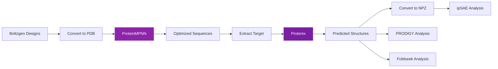

# ProteinMPNN & Protenix

## Overview

ProteinMPNN and Protenix form a sequence optimization and validation workflow that improves designed structures through iterative refinement:

1. **ProteinMPNN** optimizes amino acid sequences for Boltzgen-designed structures
2. **Protenix** predicts structures for the optimized sequences to validate refolding

This workflow helps identify sequences that maintain the desired structure while potentially improving stability, expression, or other properties.

## Workflow Diagram



## When to Use This Workflow

Enable ProteinMPNN and Protenix when you want to:

- **Optimize sequences**: Improve sequence properties while maintaining structure
- **Validate designs**: Confirm optimized sequences can refold correctly
- **Compare alternatives**: Explore sequence diversity for the same structure
- **Assess stability**: Check if predicted structures match designed structures

## Enabling the Workflow

### ProteinMPNN Only

```bash
nextflow run seqeralabs/nf-proteindesign \
    -profile docker \
    --input samplesheet.csv \
    --run_proteinmpnn \
    --outdir results
```

### ProteinMPNN + Protenix (Recommended)

```bash
nextflow run seqeralabs/nf-proteindesign \
    -profile docker \
    --input samplesheet.csv \
    --run_proteinmpnn \
    --run_protenix_refold \
    --outdir results
```

!!! note "Protenix Requires ProteinMPNN"
    The `--run_protenix_refold` flag requires `--run_proteinmpnn` to be enabled, as it operates on ProteinMPNN's output sequences.

## ProteinMPNN Parameters

### Core Parameters

| Parameter | Default | Description |
|-----------|---------|-------------|
| `--run_proteinmpnn` | `false` | Enable ProteinMPNN sequence optimization |
| `--mpnn_sampling_temp` | `0.1` | Sampling temperature (0.1-0.3 recommended, lower = more conservative) |
| `--mpnn_num_seq_per_target` | `8` | Number of sequence variants per structure |
| `--mpnn_batch_size` | `1` | Batch size for inference |
| `--mpnn_seed` | `37` | Random seed for reproducibility |
| `--mpnn_backbone_noise` | `0.02` | Backbone noise level (0.02-0.20, lower = more faithful to input) |

### Parameter Guidelines

**Sampling Temperature** (`--mpnn_sampling_temp`):
- `0.1`: Very conservative, high sequence identity to original
- `0.2`: Moderate diversity (recommended)
- `0.3`: High diversity, more sequence variation

**Number of Sequences** (`--mpnn_num_seq_per_target`):
- `4-8`: Standard, good for most applications
- `16-32`: High throughput, explore more sequence space
- `1-2`: Quick validation runs

**Backbone Noise** (`--mpnn_backbone_noise`):
- `0.02`: Minimal noise, strict adherence to backbone
- `0.10`: Moderate noise, some flexibility
- `0.20`: High noise, allows more structural variation

## Protenix Parameters

| Parameter | Default | Description |
|-----------|---------|-------------|
| `--run_protenix_refold` | `false` | Enable Protenix structure prediction |
| `--protenix_diffusion_samples` | `1` | Number of diffusion samples per sequence |
| `--protenix_seed` | `42` | Random seed for reproducibility |

### Parameter Guidelines

**Diffusion Samples** (`--protenix_diffusion_samples`):
- `1`: Standard, one prediction per sequence
- `5`: Multiple samples for consensus
- `10+`: Extensive sampling (very slow)

## Output Files

### ProteinMPNN Outputs

```
results/
└── sample_id/
    └── proteinmpnn/
        ├── sequences/                     # Optimized FASTA sequences
        │   ├── design_0001.fasta
        │   ├── design_0002.fasta
        │   └── ...
        ├── scores/                        # ProteinMPNN scores
        │   ├── design_0001_scores.npz
        │   └── ...
        └── summary/
            └── optimization_summary.txt   # Summary statistics
```

### Protenix Outputs

```
results/
└── sample_id/
    └── protenix/
        ├── structures/                    # Predicted CIF structures
        │   ├── mpnn_0001_model_0.cif
        │   ├── mpnn_0001_model_1.cif
        │   └── ...
        ├── confidence/                    # Confidence scores (JSON)
        │   ├── mpnn_0001_confidence.json
        │   └── ...
        └── npz/                          # Converted NPZ files (for ipSAE)
            ├── mpnn_0001_model_0.npz
            └── ...
```

## Interpreting Results

### ProteinMPNN Scores

Lower scores indicate better sequence-structure compatibility:

- **Score < -2.0**: Excellent sequence fit
- **Score -2.0 to -1.5**: Good fit
- **Score -1.5 to -1.0**: Acceptable fit
- **Score > -1.0**: Poor fit, may not fold correctly

### Protenix Confidence

Protenix provides multiple confidence metrics in JSON format:

```json
{
  "plddt": 85.3,           // Per-residue confidence (0-100)
  "ptm": 0.82,             // Predicted TM-score
  "iptm": 0.79,            // Interface PTM (for complexes)
  "ranking_confidence": 0.81
}
```

**Interpretation:**
- **pLDDT > 80**: High confidence structure
- **pLDDT 60-80**: Moderate confidence
- **pLDDT < 60**: Low confidence, may be disordered
- **pTM > 0.8**: Good overall structure quality

## Comparison with Boltzgen

### Structural Similarity

Compare Protenix structures to original Boltzgen designs:

```bash
# Use TM-align or similar tool
tmalign results/sample1/boltzgen/design_0001.cif \
        results/sample1/protenix/structures/mpnn_0001_model_0.cif
```

**TM-score interpretation:**
- **TM-score > 0.9**: Nearly identical structures
- **TM-score 0.7-0.9**: Similar structures
- **TM-score < 0.7**: Different structures

### Analysis Comparison

When multiple analyses are enabled, compare metrics:

```bash
# Enable all analyses for both Boltzgen and Protenix
nextflow run seqeralabs/nf-proteindesign \
    --input samplesheet.csv \
    --run_proteinmpnn \
    --run_protenix_refold \
    --run_ipsae \
    --run_prodigy \
    --run_foldseek \
    --foldseek_database /path/to/afdb \
    --run_consolidation \
    --outdir results
```

The consolidated metrics report will show:
- **Boltzgen designs**: Original structure metrics
- **Protenix designs**: Sequence-optimized structure metrics
- Side-by-side comparison of quality scores

## Use Cases

### 1. Sequence Optimization

**Goal**: Find sequences with better properties while maintaining structure

**Workflow**:
```bash
--run_proteinmpnn \
--mpnn_sampling_temp 0.2 \
--mpnn_num_seq_per_target 16
```

**Analysis**: Compare ProteinMPNN scores, select top sequences

### 2. Structural Validation

**Goal**: Verify optimized sequences maintain desired structure

**Workflow**:
```bash
--run_proteinmpnn \
--run_protenix_refold \
--protenix_diffusion_samples 1
```

**Analysis**: Compare Boltzgen vs. Protenix structures using TM-align

### 3. Comprehensive Quality Assessment

**Goal**: Full characterization of both original and optimized designs

**Workflow**:
```bash
--run_proteinmpnn \
--run_protenix_refold \
--run_ipsae \
--run_prodigy \
--run_consolidation
```

**Analysis**: Use consolidated metrics to identify best overall designs

## Performance Notes

### ProteinMPNN

- **GPU acceleration**: Recommended for large batches
- **Memory**: ~4-8 GB GPU memory
- **Time**: ~5-10 seconds per structure
- **Parallelization**: Processes multiple structures in parallel

### Protenix

- **GPU acceleration**: Required for reasonable speed
- **Memory**: ~16-32 GB GPU memory per sample
- **Time**: ~2-5 minutes per sequence
- **Parallelization**: Processes multiple sequences in parallel

### Combined Workflow

For a design with 20 budget structures and 8 sequences per structure:
- ProteinMPNN: ~5 minutes total
- Protenix: ~20 minutes total (160 predictions)
- Total overhead: ~25-30 minutes

## Troubleshooting

### ProteinMPNN Issues

**Low scores (> -1.0)**:
- Original structure may have issues
- Try adjusting `--mpnn_backbone_noise`
- Check input PDB quality

**Similar sequences**:
- Increase `--mpnn_sampling_temp` (try 0.2-0.3)
- Increase `--mpnn_num_seq_per_target`

### Protenix Issues

**Low confidence predictions**:
- Sequences may not be foldable
- Check ProteinMPNN scores first
- Try different sampling temperature

**Out of memory**:
- Reduce `--protenix_diffusion_samples`
- Process fewer structures at once
- Use GPU with more memory

### Structural Divergence

**Protenix structures differ from Boltzgen**:
- Check ProteinMPNN scores (should be < -1.5)
- Verify target sequence extraction worked correctly
- Consider if sequence optimization is too aggressive
- Try lower `--mpnn_sampling_temp`

## Best Practices

1. **Start conservative**: Use default parameters first
2. **Validate small set**: Test on 2-3 designs before full run
3. **Compare metrics**: Use consolidation to compare Boltzgen vs. Protenix
4. **Check structural similarity**: Always verify refolding maintains structure
5. **Consider tradeoffs**: Lower ProteinMPNN scores may not always mean better designs

## Integration with Other Analyses

### ipSAE

Automatically analyzes both Boltzgen and Protenix structures when enabled:

```bash
--run_ipsae  # Will process both sources
```

### PRODIGY

Predicts binding affinity for both structure types:

```bash
--run_prodigy  # Analyzes all CIF files
```

### Foldseek

Searches for homologs of both Boltzgen and Protenix designs:

```bash
--run_foldseek --foldseek_database /path/to/afdb
```

## References

- **ProteinMPNN**: Dauparas J, et al. (2022) Robust deep learning–based protein sequence design using ProteinMPNN. *Science*. [doi:10.1126/science.add2187](https://doi.org/10.1126/science.add2187)
- **Protenix**: Structure prediction model for protein folding validation

## See Also

- [ipSAE Scoring](ipsae.md) - Works with both Boltzgen and Protenix NPZ files
- [PRODIGY Binding Affinity](prodigy.md) - Analyzes all predicted structures
- [Metrics Consolidation](consolidation.md) - Compare Boltzgen vs. Protenix metrics
