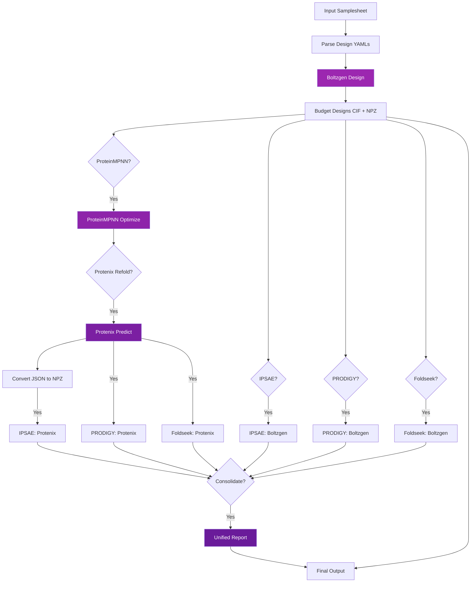

# Pipeline Architecture

## :material-sitemap: Overview

The nf-proteindesign pipeline processes design YAML specifications through Boltzgen with a comprehensive suite of optional analysis modules for sequence optimization, structure validation, and quality assessment.

## :octicons-workflow-24: Complete Pipeline Flow



## :material-puzzle: Key Components

### 1. Core Design Module

Boltzgen generates protein designs from YAML specifications:

```groovy
process BOLTZGEN_RUN {
    label 'gpu'
    
    input:
    tuple val(meta), path(design_yaml), path(structure_files)
    path cache_dir
    
    output:
    tuple val(meta), path("${meta.id}_output"), emit: results
    tuple val(meta), path("${meta.id}_output/intermediate_designs_inverse_folded/refold_cif/*.cif"), emit: budget_design_cifs
    tuple val(meta), path("${meta.id}_output/intermediate_designs_inverse_folded/refold_confidence/*.npz"), emit: budget_design_npz
    
    script:
    """
    boltzgen design \\
        --design_file ${design_yaml} \\
        --output_dir ${meta.id}_output \\
        --num_designs ${meta.num_designs} \\
        --budget ${meta.budget}
    """
}
```

### 2. ProteinMPNN Sequence Optimization

Optimizes sequences for designed structures:

```groovy
workflow {
    if (params.run_proteinmpnn) {
        CONVERT_CIF_TO_PDB(budget_designs)
        PROTEINMPNN_OPTIMIZE(pdb_files)
        
        if (params.run_protenix_refold) {
            EXTRACT_TARGET_SEQUENCES(boltzgen_structures)
            PROTENIX_REFOLD(mpnn_sequences, target_sequences)
            CONVERT_PROTENIX_TO_NPZ(protenix_outputs)
        }
    }
}
```

### 3. Parallel Analysis Modules

Multiple analyses run simultaneously:

```groovy
workflow {
    // All analyses run in parallel on budget designs
    if (params.run_ipsae) {
        IPSAE_CALCULATE(boltzgen_cifs, boltzgen_npz)
        if (protenix_enabled) {
            IPSAE_CALCULATE(protenix_cifs, protenix_npz)
        }
    }
    
    if (params.run_prodigy) {
        PRODIGY_PREDICT(all_cif_files)
    }
    
    if (params.run_foldseek) {
        FOLDSEEK_SEARCH(all_cif_files, database)
    }
    
    if (params.run_consolidation) {
        CONSOLIDATE_METRICS(all_results)
    }
}
```

## :material-package: Process Organization

### Core Processes

| Process | Purpose | Label |
|---------|---------|-------|
| `BOLTZGEN_RUN` | Design proteins with Boltzgen | `gpu` |
| `CONVERT_CIF_TO_PDB` | Convert CIF to PDB format | `cpu` |
| `PROTEINMPNN_OPTIMIZE` | ProteinMPNN sequence optimization | `gpu` |
| `EXTRACT_TARGET_SEQUENCES` | Extract sequences from structures | `cpu` |
| `PROTENIX_REFOLD` | Protenix structure prediction | `gpu` |
| `CONVERT_PROTENIX_TO_NPZ` | Convert confidence JSON to NPZ | `cpu` |
| `IPSAE_CALCULATE` | ipSAE interface scoring | `gpu` |
| `PRODIGY_PREDICT` | PRODIGY binding affinity prediction | `cpu` |
| `FOLDSEEK_SEARCH` | Foldseek structural search | `gpu` |
| `CONSOLIDATE_METRICS` | Generate consolidated report | `cpu` |

### Resource Labels

```groovy
process {
    withLabel: cpu {
        cpus = 4
        memory = 16.GB
    }
    
    withLabel: gpu {
        cpus = 8
        memory = 32.GB
        clusterOptions = '--gres=gpu:1'
    }
}
```

## :material-file-tree: Module Structure

```
main.nf                              # Main entry point
workflows/
└── protein_design.nf                # Main workflow orchestration

modules/local/
├── boltzgen_run.nf                  # Boltzgen design generation
├── convert_cif_to_pdb.nf            # CIF to PDB conversion
├── proteinmpnn_optimize.nf          # ProteinMPNN optimization
├── extract_target_sequences.nf      # Extract target sequences
├── protenix_refold.nf               # Protenix structure prediction
├── convert_protenix_to_npz.nf       # JSON to NPZ conversion
├── ipsae_calculate.nf               # ipSAE interface scoring
├── prodigy_predict.nf               # PRODIGY binding affinity
├── foldseek_search.nf               # Foldseek structural search
└── consolidate_metrics.nf           # Metrics consolidation
```

## :material-cog: Configuration

### Profile System

```groovy
profiles {
    docker {
        docker.enabled = true
        docker.runOptions = '--gpus all'
    }
    
    test {
        includeConfig 'conf/test.config'
    }
}
```

### Resource Management

```groovy
params {
    max_cpus = 16
    max_memory = 128.GB
    max_time = 48.h
}
```

## :material-speedometer: Execution Flow

### 1. Initialization

- Parse samplesheet with design YAMLs
- Validate inputs and structure files
- Create input channels

### 2. Design Generation

- Parallel Boltzgen design runs
- Generate budget designs (CIF + NPZ)
- GPU-accelerated diffusion sampling

### 3. Sequence Optimization (Optional)

- Convert CIF to PDB format
- ProteinMPNN sequence optimization
- Protenix structure prediction
- Convert Protenix JSON to NPZ

### 4. Parallel Analysis (Optional)

- **ipSAE**: Interface quality scoring (Boltzgen + Protenix)
- **PRODIGY**: Binding affinity prediction (all structures)
- **Foldseek**: Structural similarity search (all structures)

### 5. Consolidation (Optional)

- Collect all analysis metrics
- Generate unified CSV report
- Create markdown summary

## :material-chart-timeline: Performance Characteristics

### Parallelization

```
Samples:    Parallel across all samples
Designs:    Parallel within each sample
GPU:        One design per GPU at a time
```

### Scaling

| Resources | Throughput |
|-----------|------------|
| 1 GPU | ~6 designs/hour |
| 4 GPUs | ~24 designs/hour |
| 8 GPUs | ~48 designs/hour |

## :material-source-branch: Development

### Adding New Modules

```groovy
// modules/new_tool/main.nf
process NEW_TOOL {
    label 'cpu'
    
    input:
    tuple val(sample), path(input_file)
    
    output:
    tuple val(sample), path("output/*")
    
    script:
    """
    new_tool --input ${input_file} --output output/
    """
}
```

## :material-book-open: Further Reading

- [Implementation Details](implementation.md)
- [Nextflow Documentation](https://www.nextflow.io/docs/latest/)
- [DSL2 Guide](https://www.nextflow.io/docs/latest/dsl2.html)

---

!!! note "Extensibility"
    The modular architecture makes it easy to add new analysis tools or features while maintaining compatibility with existing workflows.
