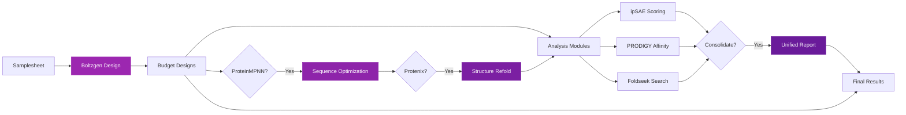

# nf-proteindesign

!!! warning "Proof of Principle Pipeline"
    This pipeline was developed by Seqera as a proof of principle using Seqera AI. It demonstrates the capabilities of AI-assisted bioinformatics pipeline development but should be thoroughly validated before use in production environments.

<div style="text-align: center; margin: 2rem 0;">
  
  
</div>

## :material-test-tube: Overview

**nf-proteindesign** is a Nextflow pipeline for high-throughput protein design using [Boltzgen](https://github.com/HannesStark/boltzgen), an all-atom generative diffusion model. Design proteins, peptides, and nanobodies to bind various biomolecular targets with a comprehensive suite of downstream analysis modules.

!!! tip "Modular Analysis Pipeline"
    The pipeline combines Boltzgen design with optional sequence optimization (ProteinMPNN + Protenix), quality assessment (ipSAE, PRODIGY, Foldseek), and unified reporting (metrics consolidation).
## :material-package-variant-closed: Analysis Modules

<div class="feature-grid">
  <div class="feature-card">
    <h3>🧬 ProteinMPNN</h3>
    <p>Sequence optimization for designed structures with configurable sampling temperature.</p>
    <code>--run_proteinmpnn</code>
  </div>
  
  <div class="feature-card">
    <h3>🔄 Protenix</h3>
    <p>Structure prediction for ProteinMPNN sequences to validate refolding.</p>
    <code>--run_protenix_refold</code>
  </div>
  
  <div class="feature-card">
    <h3>📊 ipSAE</h3>
    <p>Interface quality scoring for Boltzgen and Protenix structures.</p>
    <code>--run_ipsae</code>
  </div>
  
  <div class="feature-card">
    <h3>⚡ PRODIGY</h3>
    <p>Binding affinity prediction (ΔG and Kd) for all structures.</p>
    <code>--run_prodigy</code>
  </div>
  
  <div class="feature-card">
    <h3>🔍 Foldseek</h3>
    <p>Structural similarity search in AlphaFold/Swiss-Model databases.</p>
    <code>--run_foldseek</code>
  </div>
  
  <div class="feature-card">
    <h3>📈 Consolidation</h3>
    <p>Unified CSV report combining all analysis metrics.</p>
    <code>--run_consolidation</code>
  </div>
</div>

## :material-lightning-bolt: Key Features

- **:material-parallel: Parallel Processing**: Run multiple design specifications simultaneously
- **:material-file-code: YAML-Based Design**: Complete control with custom design specifications
- **:material-chart-line: Comprehensive Analysis**: Six optional analysis modules for quality assessment
- **:material-refresh: Sequence Optimization**: ProteinMPNN + Protenix validation workflow
- **:material-docker: Container Support**: Full Docker compatibility
- **:material-gpu: GPU Acceleration**: Optimized for NVIDIA GPU execution
- **:material-file-tree: Organized Outputs**: Structured results with unified reporting

## :material-pipeline: Pipeline Workflow



## :material-rocket-launch: Quick Start

Get started with nf-proteindesign in minutes:

```bash
# 1. Install Nextflow (>=23.04.0)
curl -s https://get.nextflow.io | bash

# 2. Run the pipeline
nextflow run seqeralabs/nf-proteindesign \
    -profile docker \
    --input samplesheet.csv \
    --outdir results
```

!!! example "Need Help?"
    Check out the [Quick Start Guide](quick-start.md) for detailed setup instructions and examples.

## :material-chemical-weapon: What Can You Design?

The pipeline leverages Boltzgen's capabilities to design:

- **Proteins**: Full-length protein binders targeting specific interfaces
- **Peptides**: Short peptide sequences for tight binding
- **Nanobodies**: Compact antibody fragments for therapeutic applications
- **Multi-target Binders**: Design to multiple targets simultaneously

All with the flexibility to specify:
- Binding site residues
- Designed chain type (protein, peptide, nanobody)
- Chain length constraints
- Custom diffusion parameters

## :material-file-document: Documentation Structure

<div class="feature-grid">
  <div class="feature-card">
    <h3>Getting Started</h3>
    <p>Installation, basic usage, and quick reference guides.</p>
  </div>
  
  <div class="feature-card">
    <h3>Pipeline Modes</h3>
    <p>Detailed documentation for each operational mode.</p>
  </div>
  
  <div class="feature-card">
    <h3>Analysis Tools</h3>
    <p>PRODIGY and ipSAE integration guides.</p>
  </div>
  
  <div class="feature-card">
    <h3>Architecture</h3>
    <p>Technical details and implementation notes.</p>
  </div>
</div>

## :material-server: Computing Requirements

!!! info "Hardware Requirements"
    **GPU**: NVIDIA GPU with CUDA support (recommended for reasonable execution times)  
    **Memory**: Minimum 16GB RAM, 32GB+ recommended for large designs  
    **Storage**: 50GB+ for pipeline dependencies and outputs

## :octicons-people-24: Contributing

We welcome contributions! The pipeline is designed with modularity and extensibility in mind.

## :material-license: License

This project is licensed under the MIT License - see the [LICENSE](https://github.com/seqeralabs/nf-proteindesign/blob/main/LICENSE) file for details.

---

<div style="text-align: center; margin-top: 3rem; color: #666;">
  Built with :material-heart: using Nextflow and Material for MkDocs
</div>
