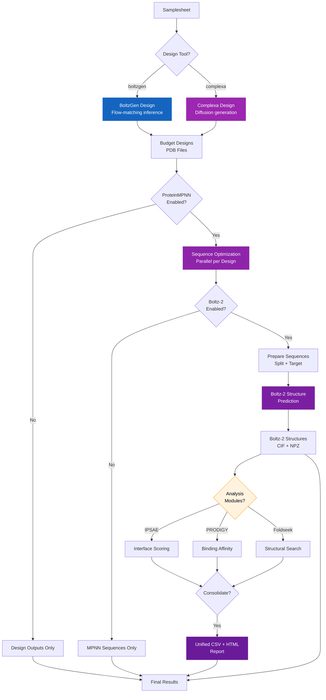

# nf-proteindesign

!!! warning "Proof of Principle Pipeline"
    This pipeline was developed by Seqera as a proof of principle using Seqera AI. It demonstrates the capabilities of AI-assisted bioinformatics pipeline development but should be thoroughly validated before use in production environments.

<div style="text-align: center; margin: 2rem 0;">
  
  
  
  
</div>

## :material-test-tube: Overview

**nf-proteindesign** is a Nextflow pipeline for high-throughput protein design supporting two generative backends:

- **[BoltzGen](https://github.com/jostorge/boltz)** (default) — a flow-matching generative model that uses design YAML specifications
- **[Proteina-Complexa](https://github.com/Proteina-AI/complexa)** — an all-atom generative diffusion model that uses pipeline config YAMLs

Design proteins, peptides, and nanobodies to bind various biomolecular targets with a comprehensive suite of downstream analysis modules. Both design backends converge into the same shared downstream pipeline.

!!! tip "Modular Analysis Pipeline"
    The pipeline combines generative protein design (BoltzGen or Complexa) with sequence optimization (ProteinMPNN + Boltz-2), quality assessment (ipSAE, PRODIGY, Foldseek), and unified reporting (metrics consolidation).
## :material-package-variant-closed: Design Backends & Analysis Modules

<div class="feature-grid">
  <div class="feature-card">
    <h3>🎯 BoltzGen</h3>
    <p>Flow-matching generative model for protein design (default backend).</p>
    <code>--protein_design_tool boltzgen</code>
  </div>

  <div class="feature-card">
    <h3>🏗️ Proteina-Complexa</h3>
    <p>All-atom generative diffusion model using pipeline config YAMLs.</p>
    <code>--protein_design_tool complexa</code>
  </div>

  <div class="feature-card">
    <h3>🧬 ProteinMPNN</h3>
    <p>Sequence optimization for designed structures with configurable sampling temperature.</p>
    <code>--run_proteinmpnn</code>
  </div>
  
  <div class="feature-card">
    <h3>🔄 Boltz-2</h3>
    <p>Structure prediction for ProteinMPNN sequences to validate refolding.</p>
    <code>--run_boltz2_refold</code>
  </div>
  
  <div class="feature-card">
    <h3>📊 ipSAE</h3>
    <p>Interface quality scoring for Boltz-2 refolded structures.</p>
    <code>--run_ipsae</code>
  </div>
  
  <div class="feature-card">
    <h3>⚡ PRODIGY</h3>
    <p>Binding affinity prediction (ΔG and Kd) for all structures.</p>
    <code>--run_prodigy</code>
  </div>
  
  <div class="feature-card">
    <h3>🔍 Foldseek</h3>
    <p>Structural similarity search in AlphaFold/Swiss-Model databases.</p>
    <code>--run_foldseek</code>
  </div>
  
  <div class="feature-card">
    <h3>📈 Consolidation</h3>
    <p>Unified CSV report combining all analysis metrics.</p>
    <code>--run_consolidation</code>
  </div>
</div>

## :material-lightning-bolt: Key Features

- **:material-swap-horizontal: Dual Design Backends**: Choose BoltzGen (default) or Proteina-Complexa
- **:material-parallel: Parallel Processing**: Run multiple design specifications simultaneously
- **:material-file-code: YAML-Based Design**: Complete control with custom design specifications
- **:material-chart-line: Comprehensive Analysis**: Six optional analysis modules for quality assessment
- **:material-refresh: Sequence Optimization**: ProteinMPNN + Boltz-2 validation workflow
- **:material-docker: Container Support**: Full Docker and Singularity compatibility
- **:material-gpu: GPU Acceleration**: Optimized for NVIDIA GPU execution
- **:material-file-tree: Organized Outputs**: Structured results with unified reporting

## :material-pipeline: Pipeline Workflow


```mermaid
graph TB
    A[Samplesheet] --> B{Design Tool?}
    B -->|boltzgen| C[BoltzGen Design<br/>Flow-matching inference]
    B -->|complexa| D[Complexa Design<br/>Diffusion generation]
    
    C --> E[Budget Designs<br/>PDB Files]
    D --> E
    
    E --> F{ProteinMPNN<br/>Enabled?}
    F -->|No| Z[Design Outputs Only]
    F -->|Yes| G[Sequence Optimization<br/>Parallel per Design]
    
    G --> H{Boltz-2<br/>Enabled?}
    H -->|No| Y[MPNN Sequences Only]
    H -->|Yes| I[Prepare Sequences<br/>Split + Target]
    
    I --> J[Boltz-2 Structure<br/>Prediction]
    J --> K[Boltz-2 Structures<br/>CIF + NPZ]
    
    K --> L{Analysis<br/>Modules?}
    L -->|IPSAE| M[Interface Scoring]
    L -->|PRODIGY| N[Binding Affinity]
    L -->|Foldseek| O[Structural Search]
    
    M --> P{Consolidate?}
    N --> P
    O --> P
    P -->|Yes| Q[Unified CSV + HTML<br/>Report]
    
    Q --> R[Final Results]
    K --> R
    Z --> R
    Y --> R
    
    style C fill:#1565C0,stroke:#1565C0,color:#fff
    style D fill:#9C27B0,stroke:#9C27B0,color:#fff
    style G fill:#8E24AA,stroke:#8E24AA,color:#fff
    style J fill:#7B1FA2,stroke:#7B1FA2,color:#fff
    style Q fill:#6A1B9A,stroke:#6A1B9A,color:#fff
    
    classDef note fill:#FFF3E0,stroke:#FF9800,color:#000
    class L note
```

!!! info "Analysis Requirements"
    **IPSAE, PRODIGY, and Foldseek** require **both** `--run_proteinmpnn` and `--run_boltz2_refold` to be enabled. These modules analyze only the Boltz-2 refolded structures, not the original design outputs.

## :material-rocket-launch: Quick Start

Get started with nf-proteindesign in minutes:

```bash
# 1. Install Nextflow (>=23.04.0)
curl -s https://get.nextflow.io | bash

# 2a. Run with BoltzGen (default)
nextflow run seqeralabs/nf-proteindesign \
    -profile docker \
    --input samplesheet.csv \
    --outdir results

# 2b. Or run with Complexa
nextflow run seqeralabs/nf-proteindesign \
    -profile docker \
    --protein_design_tool complexa \
    --input samplesheet_complexa.csv \
    --complexa_ckpt_dir /path/to/checkpoints \
    --outdir results
```

!!! example "Need Help?"
    Check out the [Quick Start Guide](quick-start.md) for detailed setup instructions and examples.

## :material-chemical-weapon: What Can You Design?

The pipeline leverages BoltzGen or Complexa to design:

- **Proteins**: Full-length protein binders targeting specific interfaces
- **Peptides**: Short peptide sequences for tight binding
- **Nanobodies**: Compact antibody fragments for therapeutic applications
- **Multi-target Binders**: Design to multiple targets simultaneously

All with the flexibility to specify:
- Binding site residues
- Designed chain type (protein, peptide, nanobody)
- Chain length constraints
- Custom diffusion parameters

## :material-file-document: Documentation Structure

<div class="feature-grid">
  <div class="feature-card">
    <h3>Getting Started</h3>
    <p>Installation, basic usage, and quick reference guides.</p>
  </div>
  
  <div class="feature-card">
    <h3>Pipeline Modes</h3>
    <p>Detailed documentation for each operational mode.</p>
  </div>
  
  <div class="feature-card">
    <h3>Analysis Tools</h3>
    <p>PRODIGY and ipSAE integration guides.</p>
  </div>
  
  <div class="feature-card">
    <h3>Architecture</h3>
    <p>Technical details and implementation notes.</p>
  </div>
</div>

## :material-server: Computing Requirements

!!! info "Hardware Requirements"
    **GPU**: NVIDIA GPU with CUDA support (recommended for reasonable execution times)  
    **Memory**: Minimum 16GB RAM, 32GB+ recommended for large designs  
    **Storage**: 50GB+ for pipeline dependencies and outputs

## :octicons-people-24: Contributing

We welcome contributions! The pipeline is designed with modularity and extensibility in mind.

## :material-license: License

This project is licensed under the MIT License - see the [LICENSE](https://github.com/seqeralabs/nf-proteindesign/blob/main/LICENSE) file for details.

---

<div style="text-align: center; margin-top: 3rem; color: #666;">
  Built with :material-heart: using Nextflow and Material for MkDocs
</div>
