# Pipeline Modes Overview

The nf-proteindesign pipeline features a **unified workflow architecture** with three distinct operational modes that all converge into a single execution path. This design provides maximum flexibility while maintaining consistency.

## :material-compare: Mode Comparison

| Feature | Design Mode 📄 | Target Mode 🎯 | Binder Mode 🔬 |
|---------|---------------|---------------|----------------|
| **Input Required** | Design YAML files | Target structure + parameters | Target structure only |
| **Binding Site** | Manually specified | Manually specified | Auto-predicted |
| **Design Control** | Full control | High control | Automated |
| **Use Case** | Precise designs | Systematic exploration | Unknown binding sites |
| **Designs Generated** | One per YAML | Multiple variants | Multiple per predicted site |
| **Best For** | Known requirements | Parameter screening | Discovery phase |

## :octicons-workflow-24: Unified Architecture

All two modes share the same core workflow but with different entry points:

```mermaid
flowchart LR
    A[Design Mode 📄] --> D[Unified Workflow Entry]
    B[Target Mode 🎯] --> D
    C[Binder Mode 🔬] --> D
    
    D --> E[Parallel Boltzgen Execution]
    E --> F{Optional Analysis}
    F -->|IPSAE| G[Interaction Scoring]
    F -->|PRODIGY| H[Affinity Prediction]
    G --> I[Final Results]
    H --> I
    
    style D fill:#9C27B0,color:#fff
    style I fill:#8E24AA,color:#fff
```



### Benefits of Unified Architecture

!!! success "Advantages"
    - ✅ **Consistent execution** across all modes
    - ✅ **Simplified maintenance** and testing  
    - ✅ **Easy mode switching** for different projects
    - ✅ **All modes benefit** from improvements
    - ✅ **Unified output structure** for downstream analysis

## :material-robot: Automatic Mode Detection

The pipeline can automatically detect which mode to use based on your samplesheet columns:

```python
# Auto-detection logic
if 'design_yaml' in columns:
    mode = 'design'
elif 'target_structure' in columns:
    if 'target_residues' in columns:
        mode = 'target'
    else:
        mode = 'binder'
```

!!! tip "Explicit vs Automatic"
    While auto-detection is convenient, you can always specify the mode explicitly with `--mode` for clarity:
    ```bash
    nextflow run ... --mode design  # Explicit
    nextflow run ...                # Auto-detect
    ```

## :material-selection-multiple: Choosing the Right Mode

### Use Design Mode When:

- ✅ You have **specific design requirements**
- ✅ You've already **prepared design specifications**
- ✅ You want **full control** over parameters
- ✅ You're **iterating on specific designs**

[Learn more about Design Mode →](design-mode.md)

### Use Target Mode When:

- ✅ You want to **explore design space systematically**
- ✅ You need **multiple binder sizes**
- ✅ You're running **high-throughput screens**
- ✅ You want **automatic variant generation**

[Learn more about Target Mode →](target-mode.md)

### Use Binder Mode When:

- ✅ **Binding site is unknown**
- ✅ You want **ML-predicted pockets**
- ✅ You're in the **discovery phase**
- ✅ You want to explore **multiple potential sites**

[Learn more about Binder Mode →](binder-mode.md)

## :material-file-table: Samplesheet Examples

=== "Design Mode"
    ```csv
    sample,design_yaml
    antibody1,designs/antibody_design1.yaml
    antibody2,designs/antibody_design2.yaml
    peptide1,designs/peptide_binder.yaml
    ```

=== "Target Mode"
    ```csv
    sample,target_structure,target_residues,chain_type,min_length,max_length
    egfr,data/egfr.pdb,"10,11,12,45",protein,60,120
    spike,data/spike.pdb,"417,484,501",nanobody,110,130
    ```

=== "Binder Mode"
    ```csv
    sample,target_structure,chain_type,min_length,max_length
    binder1,data/target1.pdb,protein,50,100
    binder2,data/target2.pdb,nanobody,110,130
    ```

## :material-cog: Mode-Specific Parameters

### Common to All Modes

```bash
--input             # Samplesheet (required)
--outdir            # Output directory
--run_ipsae         # Enable IPSAE scoring
--run_prodigy       # Enable PRODIGY prediction
--n_samples         # Number of designs per specification
--timesteps         # Diffusion timesteps
```

### Design Mode Parameters

```bash
--mode design       # Explicit mode specification
# All parameters come from YAML files
```

### Target Mode Parameters

```bash
--mode target                # Explicit mode specification
--min_design_length         # Minimum binder length
--max_design_length         # Maximum binder length  
--length_step               # Length increment
--n_variants_per_length     # Variants per length
--chain_type                # Default: protein
```

### Binder Mode Parameters

```bash
--mode binder               # Explicit mode specification
--min_design_length         # Minimum binder length
--max_design_length         # Maximum binder length
--length_step               # Length increment
--n_variants_per_length     # Variants per length
--chain_type                # Default: protein
# Binding sites are auto-predicted
```

## :material-file-tree: Output Structure Comparison

All modes produce similarly structured outputs:

```
results/
├── {sample_id}/
│   ├── boltzgen/                    # Mode-specific preprocessing
│   │   ├── design_variants/         # (Target/Binder modes)
│   │   ├── predicted_pockets/       # (Binder mode only)
│   │   ├── final_ranked_designs/    # Final outputs (all modes)
│   │   └── intermediate_designs/
│   ├── ipsae/
│   │   └── {sample}_ipsae_scores.csv
│   └── prodigy/
│       └── {sample}_prodigy_predictions.csv
└── pipeline_info/
    ├── execution_report.html
    └── execution_timeline.html
```

## :material-speedometer: Performance Characteristics

| Metric | Design Mode | Target Mode | Binder Mode |
|--------|-------------|-------------|-------------|
| **Setup Time** | Fast | Medium | Slow (ML prediction) |
| **Designs per Sample** | 1 | 10-50+ | 5-20 per pocket |
| **Total Runtime** | Baseline | 10-50× baseline | 20-100× baseline |
| **Parallelization** | Per sample | Per variant | Per pocket + variant |
| **Resource Usage** | Low | Medium-High | High |

!!! info "Runtime Scaling"
    All modes scale linearly with the number of samples and designs. Use appropriate `--max_cpus` and `--max_memory` settings for your workload.

## :material-lightbulb: Best Practices

### For All Modes

1. **Start Small**: Test with 1-2 samples before full run
2. **Check Logs**: Review `boltzgen.log` for each design
3. **Monitor Resources**: Watch GPU memory usage
4. **Use Resume**: Add `-resume` for failed runs

### Mode-Specific Tips

=== "Design Mode"
    - Validate YAML files before running
    - Use consistent naming conventions
    - Keep design files in version control

=== "Target Mode"
    - Start with fewer variants (`--n_variants_per_length 2`)
    - Use wider length steps initially (`--length_step 30`)
    - Review generated YAMLs in output

=== "Binder Mode"
    - Check predicted pockets make biological sense
    - Validate pocket predictions before large-scale runs
    - Consider multiple predicted sites for comprehensive coverage

## :material-arrow-right: Next Steps

Choose your mode and dive deeper:

<div class="feature-grid">
  <div class="feature-card">
    <h3>📄 Design Mode</h3>
    <p>Learn about YAML specifications and custom designs</p>
    <a href="design-mode.md">Read more →</a>
  </div>
  
  <div class="feature-card">
    <h3>🎯 Target Mode</h3>
    <p>Explore automatic variant generation</p>
    <a href="target-mode.md">Read more →</a>
  </div>
  
  <div class="feature-card">
    <h3>🔬 Binder Mode</h3>
    <p>Discover binders with auto-predicted binding sites</p>
    <a href="binder-mode.md">Read more →</a>
  </div>
</div>
